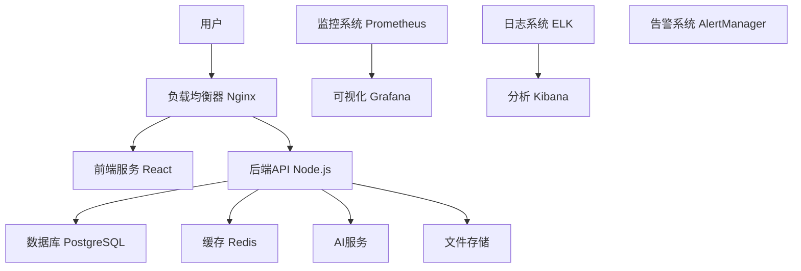

# AI设计平台运维指南

## 📋 目录

1. [系统架构](#系统架构)
2. [环境配置](#环境配置)
3. [部署指南](#部署指南)
4. [监控体系](#监控体系)
5. [备份策略](#备份策略)
6. [故障排查](#故障排查)
7. [性能优化](#性能优化)
8. [安全运维](#安全运维)
9. [升级维护](#升级维护)
10. [应急预案](#应急预案)

---

## 系统架构

### 整体架构图



### 服务组件

| 组件 | 版本 | 用途 | 端口 |
|------|------|------|------|
| Nginx | 1.24+ | 反向代理、静态文件服务 | 80,443 |
| Node.js | 18+ | 后端API服务 | 3001 |
| React | 18+ | 前端应用 | 3000 |
| PostgreSQL | 14+ | 主数据库 | 5432 |
| Redis | 7+ | 缓存、会话存储 | 6379 |
| Prometheus | 2.40+ | 指标收集 | 9090 |
| Grafana | 9.0+ | 监控可视化 | 3002 |

---

## 环境配置

### 生产环境要求

#### 硬件配置

**最低配置**
- CPU: 4核心
- 内存: 8GB
- 存储: 100GB SSD
- 网络: 100Mbps

**推荐配置**
- CPU: 8核心
- 内存: 16GB
- 存储: 500GB SSD
- 网络: 1Gbps

**企业级配置**
- CPU: 16核心
- 内存: 32GB
- 存储: 1TB SSD + 2TB HDD
- 网络: 10Gbps

#### 软件依赖

```bash
# 操作系统
Ubuntu 20.04 LTS / CentOS 8 / RHEL 8

# 必需软件
Docker 20.10+
Docker Compose 2.0+
Git 2.25+
OpenSSL 1.1+

# 可选软件
kubectl (Kubernetes部署)
helm (Helm包管理)
```

### 环境变量配置

#### 数据库配置
```bash
POSTGRES_DB=ai_platform_prod
POSTGRES_USER=ai_platform_user
POSTGRES_PASSWORD=your_strong_password
POSTGRES_HOST=postgres
POSTGRES_PORT=5432
```

#### Redis配置
```bash
REDIS_PASSWORD=your_redis_password
REDIS_HOST=redis
REDIS_PORT=6379
REDIS_DB=0
```

#### 应用配置
```bash
NODE_ENV=production
PORT=3001
APP_URL=https://ai.yourdomain.com
API_URL=https://api.ai.yourdomain.com
```

#### 安全配置
```bash
JWT_SECRET=your_jwt_secret_minimum_32_characters
SESSION_SECRET=your_session_secret_here
CORS_ORIGIN=https://ai.yourdomain.com
```

---

## 部署指南

### Docker Compose部署

#### 1. 准备部署环境
```bash
# 克隆代码
git clone https://github.com/your-org/ai-design-platform.git
cd ai-design-platform

# 创建必要目录
mkdir -p logs uploads backups ssl

# 设置文件权限
chmod 600 .env.production
chmod 700 backups
```

#### 2. 配置SSL证书
```bash
# 使用Let's Encrypt获取免费SSL证书
certbot certonly --standalone -d ai.yourdomain.com -d api.ai.yourdomain.com

# 复制证书到项目目录
cp /etc/letsencrypt/live/ai.yourdomain.com/fullchain.pem nginx/ssl/cert.pem
cp /etc/letsencrypt/live/ai.yourdomain.com/privkey.pem nginx/ssl/key.pem
```

#### 3. 启动服务
```bash
# 构建并启动所有服务
docker-compose -f docker-compose.prod.yml up -d

# 查看服务状态
docker-compose -f docker-compose.prod.yml ps

# 查看日志
docker-compose -f docker-compose.prod.yml logs -f
```

#### 4. 数据库初始化
```bash
# 运行数据库迁移
docker-compose -f docker-compose.prod.yml exec backend npx prisma migrate deploy

# 初始化基础数据
docker-compose -f docker-compose.prod.yml exec backend npm run seed
```

### Kubernetes部署

#### 1. 准备Kubernetes配置
```yaml
# namespace.yaml
apiVersion: v1
kind: Namespace
metadata:
  name: ai-platform
---
# configmap.yaml
apiVersion: v1
kind: ConfigMap
metadata:
  name: app-config
  namespace: ai-platform
data:
  NODE_ENV: "production"
  PORT: "3001"
```

#### 2. 部署应用
```bash
# 应用所有配置
kubectl apply -f k8s/

# 查看部署状态
kubectl get pods -n ai-platform

# 查看服务
kubectl get services -n ai-platform
```

#### 3. 配置Ingress
```yaml
apiVersion: networking.k8s.io/v1
kind: Ingress
metadata:
  name: ai-platform-ingress
  namespace: ai-platform
  annotations:
    kubernetes.io/ingress.class: nginx
    cert-manager.io/cluster-issuer: letsencrypt-prod
spec:
  tls:
  - hosts:
    - ai.yourdomain.com
    - api.ai.yourdomain.com
    secretName: ai-platform-tls
  rules:
  - host: ai.yourdomain.com
    http:
      paths:
      - path: /
        pathType: Prefix
        backend:
          service:
            name: frontend-service
            port:
              number: 80
  - host: api.ai.yourdomain.com
    http:
      paths:
      - path: /
        pathType: Prefix
        backend:
          service:
            name: backend-service
            port:
              number: 3001
```

---

## 监控体系

### Prometheus配置

#### 主配置文件
```yaml
global:
  scrape_interval: 15s
  evaluation_interval: 15s

rule_files:
  - "rules/*.yml"
  - "../alertmanager/rules/*.yml"

alerting:
  alertmanagers:
    - static_configs:
        - targets:
          - alertmanager:9093

scrape_configs:
  - job_name: 'prometheus'
    static_configs:
      - targets: ['localhost:9090']

  - job_name: 'backend-api'
    static_configs:
      - targets: ['backend:3001']
    metrics_path: '/metrics'
    scrape_interval: 5s

  - job_name: 'postgres-exporter'
    static_configs:
      - targets: ['postgres-exporter:9187']

  - job_name: 'redis-exporter'
    static_configs:
      - targets: ['redis-exporter:9121']
```

#### 关键指标监控

**应用指标**
```promql
# HTTP请求率
rate(http_requests_total[5m])

# 响应时间
histogram_quantile(0.95, rate(http_request_duration_seconds_bucket[5m]))

# 错误率
rate(http_requests_total{status=~"5.."}[5m]) / rate(http_requests_total[5m])

# 并发连接数
active_connections_total
```

**系统指标**
```promql
# CPU使用率
100 - (avg by (instance) (irate(node_cpu_seconds_total{mode="idle"}[5m])) * 100)

# 内存使用率
(1 - (node_memory_MemAvailable_bytes / node_memory_MemTotal_bytes)) * 100

# 磁盘使用率
(1 - (node_filesystem_avail_bytes / node_filesystem_size_bytes)) * 100

# 网络流量
rate(node_network_receive_bytes_total[5m])
```

### Grafana仪表板

#### 系统概览仪表板
- CPU、内存、磁盘、网络使用情况
- 服务健康状态
- 错误率和响应时间趋势

#### 应用性能仪表板
- API请求量和响应时间
- 数据库连接池状态
- Redis缓存命中率
- AI服务调用统计

#### 业务指标仪表板
- 用户注册和活跃度
- 订阅和收入统计
- 功能使用分析
- 错误和异常统计

### 告警配置

#### 告警级别
- **Critical**: 系统不可用、数据丢失风险
- **Warning**: 性能下降、资源不足
- **Info**: 状态变更、常规事件

#### 告警渠道
- **邮件**: 核心开发团队
- **短信**: 关键系统故障
- **钉钉/企业微信**: 日常运维通知
- **PagerDuty**: 紧急故障处理

---

## 备份策略

### 数据库备份

#### 自动备份脚本
```bash
#!/bin/bash
# 数据库备份脚本

BACKUP_DIR="/backup/database"
DATE=$(date +%Y%m%d_%H%M%S)
BACKUP_FILE="ai_platform_backup_$DATE.sql"

# 创建备份目录
mkdir -p $BACKUP_DIR

# 执行备份
docker-compose -f docker-compose.prod.yml exec -T postgres pg_dump -U $POSTGRES_USER $POSTGRES_DB > $BACKUP_DIR/$BACKUP_FILE

# 压缩备份文件
gzip $BACKUP_DIR/$BACKUP_FILE

# 删除7天前的备份
find $BACKUP_DIR -name "*.sql.gz" -mtime +7 -delete

echo "数据库备份完成: $BACKUP_FILE.gz"
```

#### 备份调度
```bash
# 添加到crontab
# 每天凌晨2点执行备份
0 2 * * * /path/to/backup_database.sh

# 每周日凌晨1点执行完整备份
0 1 * * 0 /path/to/full_backup.sh
```

### 文件备份

#### 用户文件备份
```bash
#!/bin/bash
# 文件备份脚本

SOURCE_DIR="/app/uploads"
BACKUP_DIR="/backup/files"
DATE=$(date +%Y%m%d_%H%M%S)

# 使用rsync进行增量备份
rsync -av --delete $SOURCE_DIR/ $BACKUP_DIR/current/

# 创建每日快照
cp -al $BACKUP_DIR/current $BACKUP_DIR/snapshots/$DATE

# 删除30天前的快照
find $BACKUP_DIR/snapshots -maxdepth 1 -type d -mtime +30 -exec rm -rf {} \;
```

### 配置文件备份
```bash
#!/bin/bash
# 配置文件备份

CONFIG_DIR="/backup/config"
DATE=$(date +%Y%m%d_%H%M%S)

# 备份重要配置文件
tar -czf $CONFIG_DIR/config_backup_$DATE.tar.gz \
  docker-compose.prod.yml \
  .env.production \
  nginx/ \
  monitoring/ \
  ssl/

# 删除旧备份
find $CONFIG_DIR -name "config_backup_*.tar.gz" -mtime +7 -delete
```

### 云存储备份

#### AWS S3备份
```bash
#!/bin/bash
# S3备份脚本

S3_BUCKET="s3://ai-platform-backups"
LOCAL_BACKUP="/backup"

# 上传到S3
aws s3 sync $LOCAL_BACKUP $S3_BUCKET --delete

# 设置生命周期策略
aws s3api put-bucket-lifecycle-configuration \
  --bucket ai-platform-backups \
  --lifecycle-configuration file://lifecycle.json
```

---

## 故障排查

### 常见问题诊断

#### 服务无法启动
```bash
# 检查端口占用
netstat -tlnp | grep :3001

# 检查Docker容器状态
docker-compose -f docker-compose.prod.yml ps

# 查看容器日志
docker-compose -f docker-compose.prod.yml logs backend

# 检查资源使用
docker stats
```

#### 数据库连接问题
```bash
# 测试数据库连接
docker-compose -f docker-compose.prod.yml exec backend npm run db:test

# 检查数据库日志
docker-compose -f docker-compose.prod.yml logs postgres

# 检查连接数
docker-compose -f docker-compose.prod.yml exec postgres psql -U $POSTGRES_USER -d $POSTGRES_DB -c "SELECT count(*) FROM pg_stat_activity;"
```

#### 性能问题诊断
```bash
# 检查系统负载
top
htop
iotop

# 检查网络连接
ss -tuln
netstat -i

# 分析慢查询
docker-compose -f docker-compose.prod.yml exec postgres psql -U $POSTGRES_USER -d $POSTGRES_DB -c "SELECT query, mean_time, calls FROM pg_stat_statements ORDER BY mean_time DESC LIMIT 10;"
```

### 日志分析

#### 应用日志
```bash
# 查看实时日志
docker-compose -f docker-compose.prod.yml logs -f backend

# 搜索错误日志
docker-compose -f docker-compose.prod.yml logs backend | grep ERROR

# 分析访问模式
tail -f logs/access.log | awk '{print $1}' | sort | uniq -c | sort -nr
```

#### 系统日志
```bash
# 查看系统日志
journalctl -u docker -f

# 查看内核日志
dmesg | tail

# 查看磁盘空间使用
df -h
du -sh /var/log/*
```

---

## 性能优化

### 数据库优化

#### 索引优化
```sql
-- 分析查询性能
EXPLAIN ANALYZE SELECT * FROM users WHERE email = 'test@example.com';

-- 创建必要索引
CREATE INDEX idx_users_email ON users(email);
CREATE INDEX idx_conversations_user_id ON conversations(user_id);

-- 查看索引使用情况
SELECT * FROM pg_stat_user_indexes;
```

#### 连接池配置
```javascript
// database.config.js
module.exports = {
  url: process.env.DATABASE_URL,
  ssl: process.env.NODE_ENV === 'production',
  pool: {
    min: 2,
    max: 10,
    acquire: 30000,
    idle: 10000
  }
};
```

### 缓存策略

#### Redis缓存配置
```javascript
// cache.config.js
const redis = require('redis');

const client = redis.createClient({
  host: process.env.REDIS_HOST,
  port: process.env.REDIS_PORT,
  password: process.env.REDIS_PASSWORD,
  retryDelayOnFailover: 100,
  maxRetriesPerRequest: 3,
  lazyConnect: true
});

// 设置缓存策略
const cacheMiddleware = (duration = 300) => {
  return async (req, res, next) => {
    const key = req.originalUrl;
    const cached = await client.get(key);
    
    if (cached) {
      return res.json(JSON.parse(cached));
    }
    
    res.sendResponse = res.json;
    res.json = (body) => {
      client.setex(key, duration, JSON.stringify(body));
      res.sendResponse(body);
    };
    
    next();
  };
};
```

### 应用优化

#### 代码性能优化
```javascript
// 使用连接池
const pool = new Pool(databaseConfig);

// 批量操作
async function batchUpdate(updates) {
  const query = 'UPDATE users SET last_login = $1 WHERE id = $2';
  const batch = updates.map(update => [update.lastLogin, update.id]);
  
  await pool.query(query, batch.flat());
}

// 异步处理
const { Worker } = require('worker_threads');

function runInWorker(workerFile, taskData) {
  return new Promise((resolve, reject) => {
    const worker = new Worker(workerFile, { workerData: taskData });
    worker.on('message', resolve);
    worker.on('error', reject);
  });
}
```

#### Nginx优化
```nginx
# nginx.conf
worker_processes auto;
worker_rlimit_nofile 65535;

events {
    worker_connections 1024;
    use epoll;
    multi_accept on;
}

http {
    # 开启gzip压缩
    gzip on;
    gzip_vary on;
    gzip_min_length 1024;
    gzip_types text/plain text/css application/json application/javascript;

    # 缓存配置
    location ~* \.(jpg|jpeg|png|gif|ico|css|js)$ {
        expires 1y;
        add_header Cache-Control "public, immutable";
    }

    # 连接池配置
    upstream backend {
        server backend:3001 max_fails=3 fail_timeout=30s;
        keepalive 32;
    }
}
```

---

## 安全运维

### 访问控制

#### SSH安全配置
```bash
# /etc/ssh/sshd_config
Port 2222
PermitRootLogin no
PasswordAuthentication no
PubkeyAuthentication yes
MaxAuthTries 3
ClientAliveInterval 300
ClientAliveCountMax 2
```

#### 防火墙配置
```bash
# UFW配置
ufw default deny incoming
ufw default allow outgoing
ufw allow 2222/tcp    # SSH
ufw allow 80/tcp       # HTTP
ufw allow 443/tcp      # HTTPS
ufw enable
```

### SSL/TLS配置

#### Nginx SSL配置
```nginx
server {
    listen 443 ssl http2;
    server_name ai.yourdomain.com;

    ssl_certificate /etc/nginx/ssl/cert.pem;
    ssl_certificate_key /etc/nginx/ssl/key.pem;
    
    # 现代SSL配置
    ssl_protocols TLSv1.2 TLSv1.3;
    ssl_ciphers ECDHE-RSA-AES256-GCM-SHA512:DHE-RSA-AES256-GCM-SHA512;
    ssl_prefer_server_ciphers off;
    ssl_session_cache shared:SSL:10m;
    ssl_session_timeout 10m;
    
    # HSTS
    add_header Strict-Transport-Security "max-age=31536000; includeSubDomains" always;
    
    # 其他安全头
    add_header X-Frame-Options DENY;
    add_header X-Content-Type-Options nosniff;
    add_header X-XSS-Protection "1; mode=block";
}
```

### 安全扫描

#### 自动安全扫描
```bash
#!/bin/bash
# security_scan.sh

# 端口扫描
nmap -sS -O localhost

# SSL证书检查
sslscan ai.yourdomain.com

# 漏洞扫描
nmap --script vuln localhost

# Web应用扫描
nikto -h https://ai.yourdomain.com
```

---

## 升级维护

### 版本发布流程

#### 1. 准备发布
```bash
# 创建发布分支
git checkout -b release/v2.1.0

# 更新版本号
echo "2.1.0" > VERSION

# 运行测试套件
npm run test
npm run integration-test
npm run e2e-test
```

#### 2. 数据库迁移
```bash
# 生成迁移文件
npx prisma migrate dev --name add_new_feature

# 在测试环境验证
npx prisma migrate deploy

# 备份生产数据库
./scripts/backup_database.sh
```

#### 3. 零停机部署
```bash
# 构建新镜像
docker-compose -f docker-compose.prod.yml build

# 滚动更新
docker-compose -f docker-compose.prod.yml up -d --no-deps backend

# 健康检查
curl -f https://api.ai.yourdomain.com/health || exit 1

# 更新前端
docker-compose -f docker-compose.prod.yml up -d frontend
```

### 回滚策略

#### 快速回滚
```bash
# 回滚到上一个版本
git checkout HEAD~1

# 重新构建和部署
docker-compose -f docker-compose.prod.yml up -d --force-recreate

# 数据库回滚（如需要）
npx prisma migrate rollback
```

---

## 应急预案

### 系统故障

#### 数据库故障
1. **立即响应**（5分钟内）
   - 确认故障范围
   - 启动备用数据库
   - 通知相关人员

2. **临时恢复**（30分钟内）
   - 切换到只读模式
   - 恢复最近的备份
   - 验证数据完整性

3. **根本解决**（2小时内）
   - 修复故障原因
   - 监控系统状态
   - 更新监控规则

#### 服务不可用
1. **快速诊断**
   - 检查负载均衡器状态
   - 确认服务实例健康状态
   - 分析错误日志

2. **紧急恢复**
   - 重启异常服务
   - 扩容服务实例
   - 启用CDN缓存

3. **后续处理**
   - 分析故障原因
   - 优化监控告警
   - 更新应急预案

### 安全事件

#### 数据泄露
1. **立即响应**
   - 隔离受影响系统
   - 修改访问凭证
   - 通知安全团队

2. **调查取证**
   - 收集相关日志
   - 分析攻击路径
   - 评估影响范围

3. **恢复和改进**
   - 修复安全漏洞
   - 通知受影响用户
   - 加强安全措施

#### DDoS攻击
1. **检测和缓解**
   - 启动DDoS防护
   - 限制异常IP
   - 扩容服务资源

2. **流量清洗**
   - 配置流量清洗规则
   - 启用CDN防护
   - 监控攻击模式

3. **后续优化**
   - 更新防火墙规则
   - 优化负载均衡
   - 建立威胁情报

### 联系方式

#### 紧急联系人
- **技术负责人**: 张三 138-xxxx-xxxx
- **运维负责人**: 李四 139-xxxx-xxxx
- **安全负责人**: 王五 137-xxxx-xxxx

#### 外部支持
- **云服务商**: 阿里云 95187
- **域名服务商**: 腾讯云 95716
- **SSL服务商**: Let's Encrypt社区支持

---

**本文档将持续更新，请定期检查最新版本。**

*最后更新：2025年12月22日*